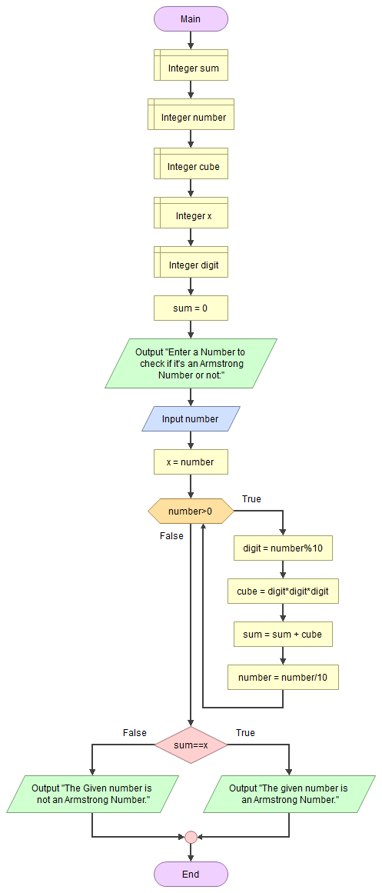

># Armstrong numbers 
---

---

 In number theory, an Armstrong Number is a number that is the sum of its own digits each raised to the power of three.

## **To Check whether a given number is an Armstrong Number or not**

> ## __Algorithm or Pseudo Code__ -
 
 1. Initialize sum = 0
 1. Read number from the user
 1. Assign x = number
 1. While number > 0 
&nbsp; &nbsp; &nbsp;assign digit = number % 10 
 &nbsp; &nbsp; &nbsp;assign cube = digit * digit * digit 
  &nbsp; &nbsp; &nbsp;assign sum = sum + cube 
   &nbsp; &nbsp; &nbsp;assign number = number/10
    
   End  
 1. If sum==x 
  
  &nbsp; &nbsp; &nbsp; output "The given number is an Armstrong Number."
    False:
    
    &nbsp; &nbsp; &nbsp;output"The Given number is not an Armstrong Number." 
 1. End  
 ---
># __Flowchart__

---
>>## __*Thank You*__
--- 

 
    

